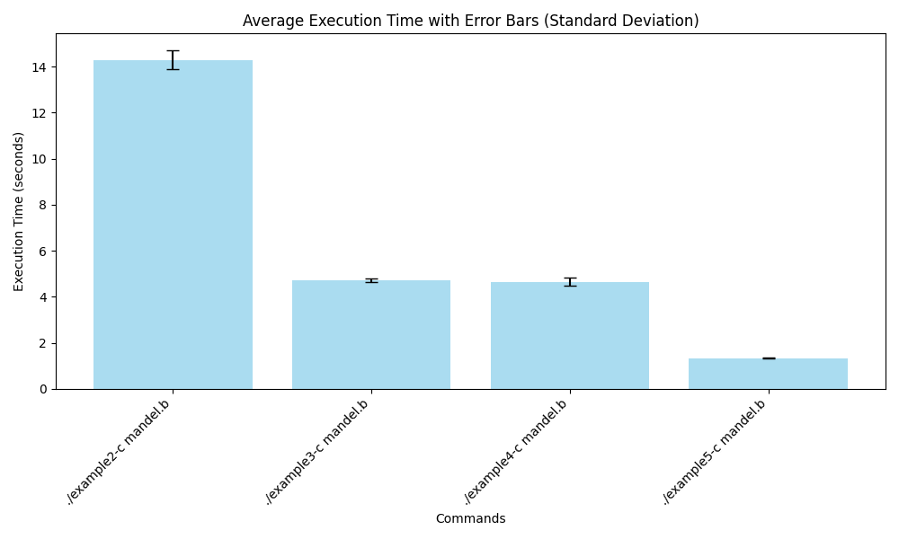

# Tutorial: Writing an Interpreter with PyPy
This is a copy of [a guest blog post by Andrew Brown](https://codespeak.net/pipermail/pypy-dev/2011q2/007128.html), which was originally posted to the pypy-dev mailing list. The original version of this tutorial was hosted on Bitbucket, but it is no longer available in 2024. This version has been reproduced to serve as educational material for lab interns at the [PRG-lab](https://prg.is.titech.ac.jp/) of Institute of Science Tokyo (from September 2024, formerly Tokyo Institute of Technology).

これは、pypy-devメーリングリストに投稿された[Andrew Brownによるゲストブログ記事](https://codespeak.net/pipermail/pypy-dev/2011q2/007128.html)のクローンです。
東京科学大学[プログラミング研究室](https://prg.is.titech.ac.jp/)の4日間のインターンコース教材として作成されました。

## Schedule
- Day 1: [Part 1](https://pypy.org/posts/2011/04/tutorial-writing-interpreter-with-pypy-3785910476193156295.html#)を読む
- Day 2: [Part 2](https://pypy.org/posts/2011/04/tutorial-part-2-adding-jit-8121732841568309472.html)を読む
- Day 3, Day 4: BFインタプリタのJITコンパイラを最適化する or [PyPyの論文](https://doc.pypy.org/en/latest/extradoc.html)を読む

## Requirements
- Python 2
- RPython

## RPython Installation (Linux)
```
git clone https://github.com/pypy/pypy
```
- `rpython` は 2024年10月時点で `pypy/rpython/bin/rpython` に配置されています。
  - ["Download and Install"](https://pypy.org/download.html) からダウンロードできるprebuildバイナリには`rpython`は含まれていないことに注意してください。
- RPythonは **Python 2** で書かれていることに注意してください。
  - Python 3で実行すると構文解析エラーが出力されます。
  - [pyenv](https://github.com/pyenv/pyenv)を使うと両バージョンを容易に切り替えられます。
  ```sh
  pyenv local x.y.z
  ```
- [Part 1](https://pypy.org/posts/2011/04/tutorial-writing-interpreter-with-pypy-3785910476193156295.html#)を最後まで完了すると、以下のような出力を得ます:

<p align="center"></p>

## トレースを見る方法
JITコンパイラがどんなコードを出しているかを調べる方法です。以下のコマンドを実行するとAが100個出るはずです。
```
PYPYLOG=jit-log-opt:logfile ./example5-c test100.b
```
`logfile`にコンパイルされたトレースが記録されています。この場合は、内側の2つのループに対応するものが `Loop1`, `Loop2` として記録されているはずです(どっちがどっちかは場合によります)。その命令を見て、無駄な命令がないかを考えます。
命令を見ても何をやっているかを想像するのは難しいのですが、
- `int_add` とか `int_sub` とかは明らかだろうと思います。
- `setarrayitem_gc`, `getarrayitem_gc` とかは配列の読み書き
- `setfield_gc`, `getfield_gc` はオブジェクトのフィールドの読み書き (フィールド名が引数に出現しているはず)
です。
インタプリタの中で `green` とした `pc`, `program`, `bracket_map` に関する命令がもし残っていたら、質のよくないコードが出ている可能性があります。

# Evaluation
PyPyツールチェーンで変換されたインタプリタの速度を比較するには `evaluate.py` を実行します。
`evaluate.py` の内部では、 `example2-c`, `example3-c`, `example4-c`, `example5-c`のそれぞれを5回ずつ実行した実行時間を記録し、平均値と分散を元に結果のグラフを出力しています。
```
python3 -m venv evalenv
source evalenv/bin/activate
python3 -m pip install numpy matplotlib
python3 evaluate.py
deactivate
```
実行例：
<p align="center"></p>
