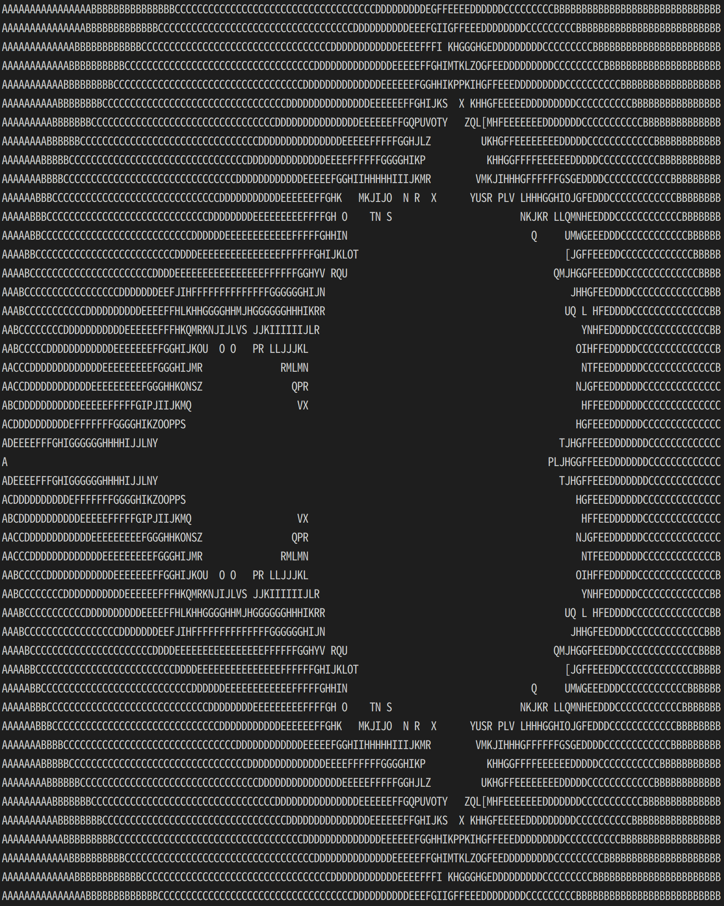
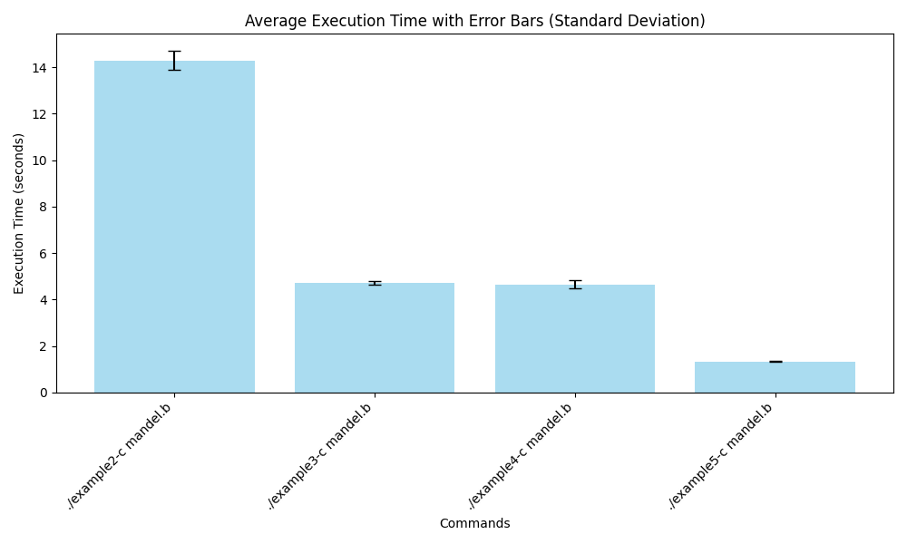

# Tutorial: Writing an Interpreter with PyPy
This is a copy of a source code of [a guest blog post by Andrew Brown](https://pypy.org/posts/2011/04/tutorial-writing-interpreter-with-pypy-3785910476193156295.html#), which was originally posted to the pypy-dev mailing list.
The original source code of this tutorial was hosted on Bitbucket, but it is no longer available in 2024.
This version has been reproduced to serve as educational material for lab interns at the [PRG-lab](https://prg.is.titech.ac.jp/) of Institute of Science Tokyo (from September 2024, formerly Tokyo Institute of Technology).

本リポジトリはpypy-devメーリングリストに投稿された[Andrew Brownによるゲストブログ記事](https://pypy.org/posts/2011/04/tutorial-writing-interpreter-with-pypy-3785910476193156295.html#)のサンプルコードのクローンです。
本リポジトリは東京科学大学[プログラミング研究室](https://prg.is.titech.ac.jp/)の4日間のインターンコース教材として作成されました。

## Schedule
- Day 1: [Tutorial: Writing an Interpreter with PyPy, Part 1](https://pypy.org/posts/2011/04/tutorial-writing-interpreter-with-pypy-3785910476193156295.html#) を読む。
  - チュートリアルに従って RPython でインタプリタを書いてみる
  - 実際に RPython/PyPy ツールチェーンを使用してインタプリタを C 言語へ変換してみる
- Day 2: [Tutorial Part 2: Adding a JIT](https://pypy.org/posts/2011/04/tutorial-part-2-adding-jit-8121732841568309472.html) を読む。
  - 作業は Day1 と同様
- Day 3, Day 4: BF インタプリタの JIT コンパイラを最適化する or [PyPyの論文](https://doc.pypy.org/en/latest/extradoc.html)を読む
- Day 5 (, Day 6): (自習) 発表スライド準備

## Requirements
- Python 2
- RPython

## Installation
`rpython`(の配置されている`pypy`)を本リポジトリのサブモジュールとして導入します。
```sh
git clone --recursive git@github.com:prg-titech/pypy-tutorial-jp.git
```

## 旧情報との差分
### `pypy` 及び `rpython` の差分管理方法の変更
Part 1 - Translating 内の `hg clone https://bitbucket.org/pypy/pypy` は古い情報です。
`rpython` は 2024年10月時点で GiHub で管理されている pypy リポジトリ内の `pypy/rpython/bin/rpython` に配置されています。

`rpython`を手動で導入する場合は、当該箇所を以下に読み換えてください。ただし、上記の導入方法(Installation)を取った場合は既に `pypy` が既にローカルに配置済みのため、不要です。
```sh
git clone https://github.com/pypy/pypy
  ```

### `rpython` で BF インタプリタを変換
Part 1最終節およびPart 2の `rpython` translatorの実行は、スクリプトの配置先の変更に伴い、`/pypy/pypy/translator/goal/translate.py` を `./pypy/rpython/bin/rpython` に読み替えてください。`(your interpreter).py`を変換するには以下を実行してください。`--opt=jit` オプションをつけると、変換先のインタプリタ `(your interpreter)-c` にJITコンパイラが生成され、実行中に使用されます。
```sh
python ./pypy/rpython/bin/rpython (--opt=jit)* (your interpreter).py
```

### 他注意点
- （注）["Download and Install"](https://pypy.org/download.html) からダウンロードできるprebuildバイナリには`rpython`は含まれていないことに注意してください。
- （注）RPythonは **Python 2** で書かれていることに注意してください。
  - Python 3で実行すると構文解析エラーが出力されます。
  - [pyenv](https://github.com/pyenv/pyenv)を使うと両バージョンを容易に切り替えられます。
  ```sh
  pyenv local x.y.z
  ```

## トレースを見る方法
JITコンパイラがどんなコードを出しているかを調べる方法です。以下のコマンドを実行するとAが100個出るはずです。
```
PYPYLOG=jit-log-opt:logfile ./example5-c test100.b
```
`logfile`にコンパイルされたトレースが記録されています。この場合は、内側の2つのループに対応するものが `Loop1`, `Loop2` として記録されているはずです(どっちがどっちかは場合によります)。その命令を見て、無駄な命令がないかを考えます。
命令を見ても何をやっているかを想像するのは難しいのですが、
- `int_add` とか `int_sub` とかは明らかだろうと思います。
- `setarrayitem_gc`, `getarrayitem_gc` とかは配列の読み書き
- `setfield_gc`, `getfield_gc` はオブジェクトのフィールドの読み書き (フィールド名が引数に出現しているはず)
です。

インタプリタの中で `green` とした `pc`, `program`, `bracket_map` に関する命令が
トレース内に残っていたら、質のよくないコードが出ている可能性があります。

他にも、 トレースにかかった時間やトレース内に記録された命令数などのまとまった統
計情報を出力するためのオプション `jit-summary`、コンパイルされた機械語を出力する
ためのオプション `jit-backend` も `PYPYLOG` はサポートしています。

以下のように指定すると複数のプロファイル情報をまとめて出力することができます。

```
PYPYLOG=jit-log-opt,jit-backend,jit-summary:logfile ./example5-c test100.b
```

全てのプロファイル情報を出力するには `PYPYLOG=jit:logfile` とします。

また `:` の右側に `-` を指定すると stderr に情報を出力することができます。

## 最適化のヒント
最適化のポイント
- Tapeオブジェクトへのアクセスに伴うread/write回数を減らしたい
- 静的に計算できるものは静的に計算してしまいたい

### ループオーバーヘッドの除去
- オーバーヘッドの予測：ループがあると、pcの指す値が0になるまで、何度もguard（readとcompareとassertion）が発生して遅い
- 最適化のアイディア：1ループでpcが移動しない幾つかのループに関しては、対応する命令で拡張したBF拡張言語を設計し、インタプリタ内で拡張命令の効率的な処理を実装することでループを除去可能

#### 頻出パターン：set 0
ループの解釈：今のpcの位置の値を0にし、pcの位置はそのまま
```
[-]
```

#### 頻出パターン：add n (Run-length encoding)
ループの解釈：今のpcの位置の値を3つ右のポインタの値に加算し(元の位置はset 0)、元のpcの位置に戻る
```
[->>>+<<<<]
```
```
[>>>+<<<-]
```
ループの解釈：今のpcの位置の値を2つ左のポインタの値に加算し(元の位置はset 0)、元のpcの位置に戻る
```
[-<<+>>]
```
```
[<<+>>-]
```

#### 頻出パターン：add nパターンの一般化 (Run-length encoding)
ループの解釈：今のpcの位置の値を1つ右,2つ右,3つ右のポインタの値にそれぞれ加算し(元の位置はset 0)、元のpcの位置に戻る
```
[->+>+>+<<<]
```
```
[>+>+>+<<<-]
```

### ループ開始位置におけるテープ位置の事前計算
要追記, 未検証

## 結果・評価
- [Part 1](https://pypy.org/posts/2011/04/tutorial-writing-interpreter-with-pypy-3785910476193156295.html#)を最後まで完了すると、以下のような出力を得ます:
```sh
./example2-c mandel.b
```
<p align="center"></p>

- PyPyツールチェーンで変換されたインタプリタの速度を比較するには `evaluate.py` を実行します。
`evaluate.py` の内部では、 `example2-c`, `example3-c`, `example4-c`, `example5-c`のそれぞれを5回ずつ実行した実行時間を記録し、平均値と分散を元に結果のグラフを出力しています。
```
python3 -m venv evalenv
source evalenv/bin/activate
python3 -m pip install numpy matplotlib
python3 evaluate.py
deactivate
```
実行例：
<p align="center"></p>

## RPython/PyPy を使用したインタプリタを最適化するヒント

Carl Friedrich が過去にまとめた [blog](https://pypy.org/posts/2011/03/controlling-tracing-of-interpreter-with_15-3281215865169782921.html) が参考になります。
